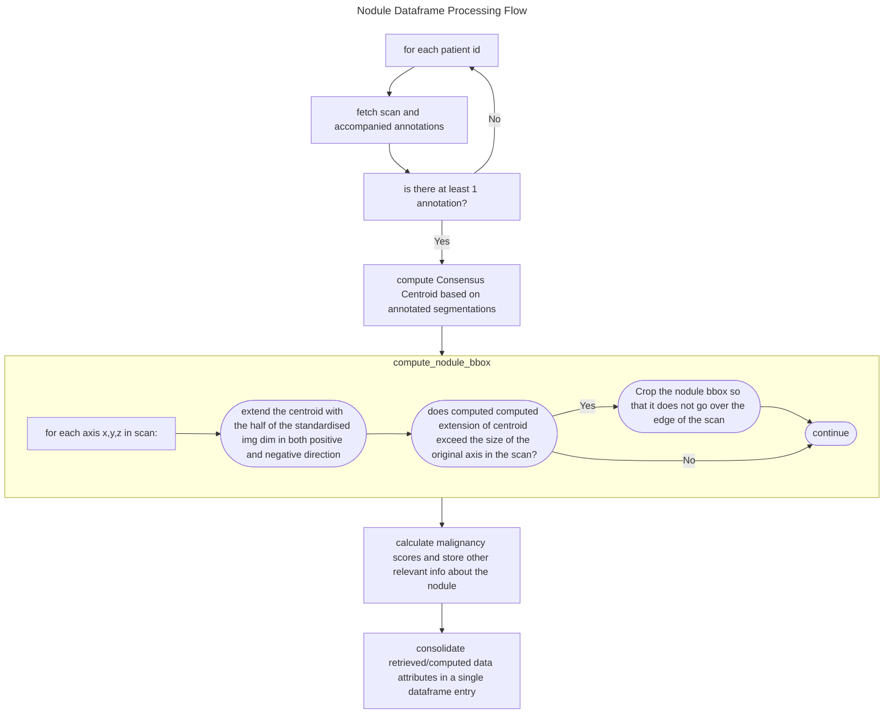

# Finding Hidden Stratifications in 3D medical data

## Setup

1. Install poetry (refer to [docs](https://python-poetry.org/docs/#installing-with-the-official-installer)):

   `curl -sSL https://install.python-poetry.org | python3 -`

2. Once installed, run `poetry install` which will install all dependencies specified in the `pyproject.toml` file

3. add a `.env` file in the root of the working directory and specify `LIDC_IDRI_DIR` as the directory path for the downloaded dataset

